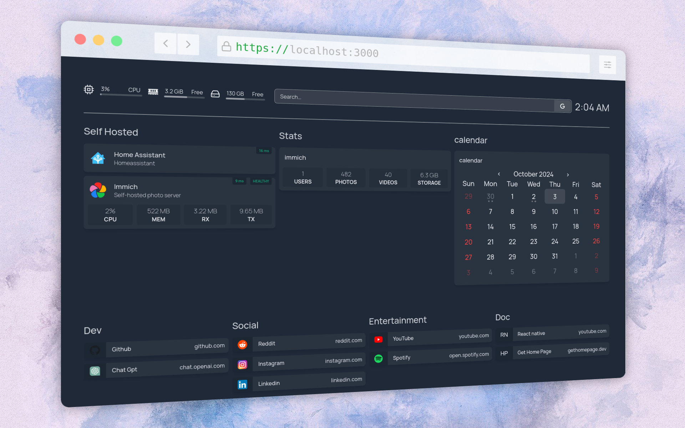

# GetHomepage Configuration Showcase

<div style="text-align: center;">
   
</div>

This repository contains the configuration files and examples for setting up GetHomepage with Docker. 
## Introduction
GetHomepage is a customizable homepage solution for displaying services and statistics from Docker containers. This repository showcases how to configure it effectively.

## Installation
To get started, you will need to have Docker installed on your machine. Follow the steps below to set up GetHomepage.

1. Clone the repository:

```bash
   git clone https://github.com/yourusername/your-repo-name.git
   cd your-repo-name
   docker-compose up -d
```
